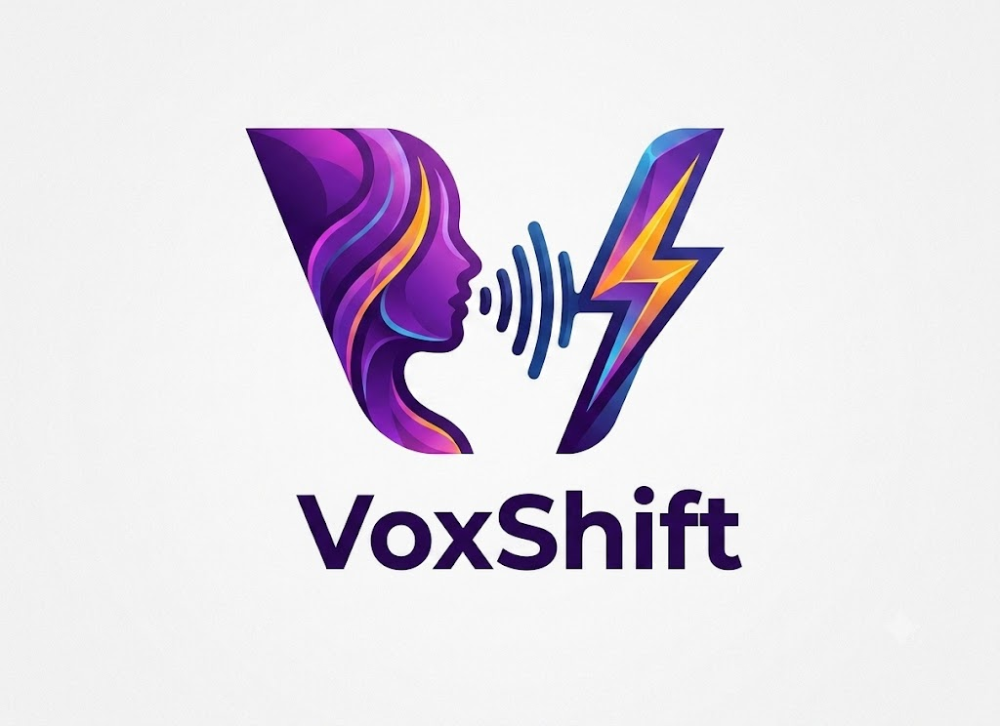

<div align="center">



# VoxShift

**The free, open-source voice changer that actually sounds real.**

Transform your voice in real time using state-of-the-art AI — no subscription, no cloud, no bullshit.

[](LICENSE)
[](https://github.com/A-Sanil/Voxshift/releases)
[](https://electronjs.org)
[](https://react.dev)
[](https://python.org)
[](https://github.com/A-Sanil/Voxshift/stargazers)

[**Download**](https://github.com/A-Sanil/Voxshift/releases) · [**Browse voices**](https://voice-models.com) · [**Discord**](https://discord.gg/voxshift) · [**Report a bug**](https://github.com/A-Sanil/Voxshift/issues)

</div>

---

## What is this?

VoxShift is a desktop app that transforms your microphone in real time using [RVC](https://github.com/RVC-Project/Retrieval-based-Voice-Conversion-WebUI) (Retrieval-based Voice Conversion) — the same AI that powers the most realistic voice clones on the internet.

You sound like a completely different person. In Discord. In Valorant. On Zoom. Right now.

**It is entirely free and runs on your own machine. Your voice never leaves your computer.**

---

## Why not just use Voicemod?

| | Voicemod | RVC WebUI | **VoxShift** |
|---|:---:|:---:|:---:|
| Cost | Paid (subscription) | Free | **Free, forever** |
| Setup | Easy | Manual CLI hell | **One installer** |
| Voice quality | Pitch shifts + presets | Real AI voice cloning | **Real AI voice cloning** |
| Voice library | ~50 locked voices | None | **Thousands — via voice-models.com** |
| Train your own voice | ✗ | CLI only | **In-app, one button** |
| Privacy | Cloud-based | Local | **100% local, zero telemetry** |
| Open source | ✗ | ✓ | **✓** |

The one thing none of them had: a clean app where you can **browse a thousand AI voices and use any of them in real time without writing a line of code.**

---

## Features

### 🎙️ Real-time voice conversion
- Under 200ms end-to-end latency on a modern GPU
- Fine-tuned pitch shift, formant shift, index ratio, input/output gain
- **Hear yourself** (monitor mode) — hear your transformed voice in your own headphones as you speak
- Noise gate / suppression built in

### 🛍️ Marketplace
- Browse thousands of community voices from [voice-models.com](https://voice-models.com) directly in the app
- Filter by category (Anime, Masculine, Feminine, Character, Robotic...)
- One-click download — model appears in your library instantly
- Preview audio before downloading *(coming v0.2)*

### 🧠 Train your own voice
- Drag-and-drop your audio files — WAV, MP3, FLAC, OGG
- Set epochs, pick pitch extraction algorithm (RMVPE / Harvest / Dio)
- Training runs in the background — freely navigate the app while it works
- Get a system notification when done

### ⚡ Designed to be fast
- Voice changer tab opens ready to go with 6 bundled demo voices
- No mandatory account, no onboarding survey, no upsell modal
- Time from opening the app to having your voice transformed: **under 60 seconds**

---

## Screenshots

<div align="center">
<table>
<tr>
<td><b>Voice changer</b></td>
<td><b>Marketplace</b></td>
</tr>
<tr>
<td></td>
<td></td>
</tr>
<tr>
<td><b>Training</b></td>
<td><b>Settings</b></td>
</tr>
<tr>
<td></td>
<td></td>
</tr>
</table>
</div>

---

## Quick start (development)

**Prerequisites:** Node.js 20+, Python 3.10+, Git

```bash
# Clone
git clone https://github.com/A-Sanil/Voxshift.git
cd Voxshift

# Frontend
npm install
npm run dev        # starts Electron + Vite dev server

# Python sidecar (separate terminal)
cd python
python -m venv .venv
.venv\Scripts\activate        # Windows
# source .venv/bin/activate   # macOS / Linux
pip install -r requirements.txt
python main.py --port 8765
```

> **GPU note:** For real-time inference, install PyTorch with CUDA/ROCm/Metal support from [pytorch.org](https://pytorch.org) *before* running `pip install -r requirements.txt`.

To verify your setup:
```bash
python python/setup.py
```

---

## Architecture

```
┌─────────────────────────────────────────────────────────────┐
│  Electron main process (Node.js)                            │
│  Window management · spawns Python sidecar · IPC bridge    │
└────────────────────────┬────────────────────────────────────┘
                         │ spawn
┌────────────────────────▼────────────────────────────────────┐
│  Python sidecar (FastAPI + uvicorn, localhost:8765)         │
│                                                             │
│  REST API  ──── GET /api/models, /api/devices, /api/settings│
│            ──── POST /api/audio/start · /api/train          │
│  WebSocket ──── ws://localhost:8765/ws                      │
│            ──── streams waveform frames + training progress  │
│                                                             │
│  AudioEngine (sounddevice)                                  │
│    Mic → buffer → [noise gate] → RVC inference → VB-Cable  │
│                                └→ monitor output (optional) │
│                                                             │
│  TrainingRunner (background thread)                         │
│    Audio preprocessing → HuBERT → RVC fine-tune → FAISS    │
│                                                             │
│  SQLite (aiosqlite)  ── models · settings · training_jobs   │
└─────────────────────────────────────────────────────────────┘
                         │ REST + WebSocket
┌────────────────────────▼────────────────────────────────────┐
│  React renderer (Vite + TypeScript)                         │
│  Zustand state · Framer Motion · Tailwind CSS               │
│  Tabs: Voice changer · Training · Marketplace · Settings    │
└─────────────────────────────────────────────────────────────┘
```

**Key design principle:** Audio never crosses the Electron IPC boundary. The sounddevice stream runs entirely inside Python — no Node.js GC spikes, no IPC overhead, true low-latency processing.

---

## Virtual audio cable setup

VoxShift outputs your transformed voice to a virtual cable. Other apps (Discord, OBS, Zoom) then see that virtual cable as a microphone.

| Platform | Driver | Notes |
|---|---|---|
| Windows | [VB-Audio VB-Cable](https://vb-audio.com/Cable/) | Free, single virtual cable |
| macOS | [BlackHole 2ch](https://existential.audio/blackhole/) | Open source |
| Linux | PipeWire virtual sink | Built into most modern distros |

In VoxShift's bottom bar, set **Out** to your virtual cable. In Discord/OBS, select the same virtual cable as your input device.

---

## Roadmap

- [x] **v0.1** — Electron shell, voice changer UI, 6 bundled voices, real-time inference stub, training wizard, marketplace browser
- [ ] **v0.2** — Live voice-models.com integration, preview audio playback, model ratings
- [ ] **v0.3** — Real RVC inference end-to-end (HuBERT + FAISS + vocoder)
- [ ] **v0.4** — macOS support + BlackHole, Apple Silicon GPU via Metal
- [ ] **v0.5** — One-click installer with bundled base models + virtual cable setup
- [ ] **v1.0** — Auto-updater, onboarding tour, public launch

---

## Contributing

PRs welcome. See [`CONTRIBUTING.md`](.github/CONTRIBUTING.md) for guidelines.

Good first issues:
- [ ] Connect the marketplace tab to the real voice-models.com API
- [ ] Integrate actual RVC inference in `python/inference.py` and `python/audio.py`
- [ ] Add audio preview playback on marketplace cards
- [ ] Build the stub installer / first-run setup wizard
- [ ] System notifications when training completes

---

## Tech stack (for the curious)

| Layer | Tech |
|---|---|
| Desktop | [Electron 31](https://electronjs.org) |
| Build | [electron-vite](https://electron-vite.org) |
| UI | [React 18](https://react.dev) + [TypeScript](https://typescriptlang.org) |
| Styling | [Tailwind CSS](https://tailwindcss.com) |
| Animations | [Framer Motion](https://framer.com/motion) |
| State | [Zustand](https://zustand-demo.pmnd.rs) |
| Backend | [FastAPI](https://fastapi.tiangolo.com) + [uvicorn](https://uvicorn.org) |
| Audio I/O | [sounddevice](https://python-sounddevice.readthedocs.io) |
| AI inference | [PyTorch](https://pytorch.org) + [FAISS](https://github.com/facebookresearch/faiss) |
| Database | [SQLite](https://sqlite.org) via [aiosqlite](https://aiosqlite.omnilib.dev) |
| Packaging | [electron-builder](https://electron.build) |

---

## Privacy

- **Zero telemetry.** No analytics, no crash reporting, no usage data.
- **No cloud.** Every byte of audio processing happens on your machine.
- **No accounts.** No sign-up, no email, nothing.
- The only network calls are: marketplace API (fetches metadata, no audio), and GitHub for auto-updates (opt-in).

---

## License

[MIT](LICENSE) — do whatever you want with it.

---

<div align="center">
Built by the community, for the community.<br/>
If VoxShift saves you a Voicemod subscription, consider giving it a ⭐
</div>
